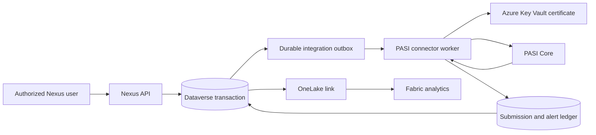

# PASI connector architecture

> [FVSD Nexus](../../README.md) / [Documentation](../README.md) / [Architecture](README.md) / PASI connector

**Status:** Proposed reference architecture; no PASI infrastructure or Dataverse connector tables have been created

## Architectural intent

The PASI connector should isolate provincial integration from interactive Nexus workflows while preserving named-user attribution, Dataverse operational truth, PASI concurrency/version state, and complete reconciliation evidence.

## Responsibilities

| Component | Responsibility |
|---|---|
| Nexus UI | Collect and display authorized operational information; never hold PASI credentials or call PASI directly. |
| Nexus API | Validate the user, role, student/school scope, business state, and request; commit Dataverse changes and integration intent. |
| Dataverse | Hold the operational record, initiating user, source context, connector status, PASI version where applicable, and reconciliation state. |
| Integration outbox | Make the Dataverse commit and later PASI transmission recoverable without relying on one distributed transaction. |
| PASI connector | Map contracts, apply PASI caller context, authenticate, submit/retrieve, classify responses, and advance checkpoints. |
| Key Vault | Protect the registered PASI client certificate/private key and support controlled rotation. |
| Operations surface | Expose queue age, failures, warnings/advice, conflicts, certificate health, and reconciliation actions without student payload telemetry. |

## Delivery guarantees

- A successful Nexus save means the Dataverse transaction is committed; it does not falsely imply PASI acceptance.
- Provincial submission status progresses independently through states such as Pending, Processing, Accepted, Attention Required, Retry Scheduled, Reconciliation Required, and Terminal Failure.
- Connector retries must be bounded and safe against duplicate provincial changes.
- A PASI optimistic-concurrency failure is a reconciliation event, not a generic retry.
- Every submission and retrieval is correlated to the applicable operational record, organization context, connector version, and safe diagnostic identifier.

## Conceptual integration records

Detailed Dataverse design is intentionally deferred. Discovery is expected to consider concepts equivalent to:

- PASI Client Configuration metadata, excluding certificate secrets.
- PASI Submission.
- PASI Submission Attempt.
- PASI Response or Core Alert.
- PASI Entity Link and last accepted `PASICoreVersion`.
- PASI Synchronization Checkpoint.
- PASI Reconciliation Item.
- Connector Contract Version and deployment metadata.

The exact number and ownership of tables must follow confirmed operations and retention rules. These concepts are not authorization to create the schema.

## Connector implementation direction

- Implement the connector as a dedicated .NET service or worker using generated/controlled SOAP clients for the approved WSDL contract.
- Keep generated contracts behind an FVSD adapter so contract upgrades do not leak throughout Nexus.
- Separate read/synchronization handlers from write/submission handlers.
- Keep mappings deterministic, version-controlled, and covered by contract tests using non-production examples.
- Use a durable queue/outbox and dead-letter/reconciliation path; select the Azure messaging component during detailed design.
- Treat PASI code values and validation rules as governed external reference data with effective-version awareness.
- Provide certificate-expiry and contract-version telemetry without exposing key material or student payloads.

## Security boundaries

- Interactive Nexus authorization remains named-user and destination-aware.
- PASI calls use the FVSD-registered system certificate and permitted `CallerInfo` organization context.
- Certificate retrieval is server-side only and protected by least-privilege managed identity.
- Production payload logging is prohibited; telemetry should contain operation name, correlation ID, timing, outcome category, and safe error code only.
- Non-production and production certificates, endpoints, queues, and reconciliation records must be isolated.
- Canadian residency and Alberta Education data-handling requirements must be confirmed before infrastructure is selected.

## Required failure tests

- Expired, revoked, or unregistered certificate.
- Unauthorized represented organization.
- Student without the required organization association.
- Stale `PASICoreVersion`.
- Contract validation exception.
- PASI warning/advice requiring attention or acknowledgement.
- Request timeout before the connector knows whether PASI accepted the operation.
- Connector restart during queue processing.
- Duplicate delivery of the same integration request.
- Synchronization checkpoint recovery after extended downtime.

## Explicit exclusions at this stage

- No PASI certificate request or registration.
- No production or non-production PASI call.
- No commitment to a specific PASI contract version.
- No PASI tables, queues, or Azure resources.
- No commitment that PASI will carry an IPP document or every IPP field.
- No retirement of Intellimedia, Jigsaw, PowerSchool integration, or another incumbent component.

## Related documentation

- [PASI capability](../capabilities/pasi-connector/README.md)
- [Official PASI reference index](../reference/pasi-resources.md)
- [Data and integrations](data-and-integrations.md)
- [Identity, licensing, and security](identity-licensing-security.md)
