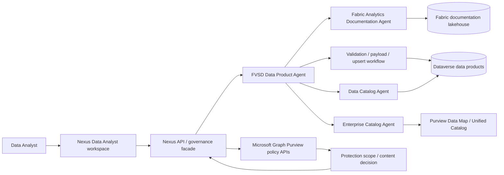
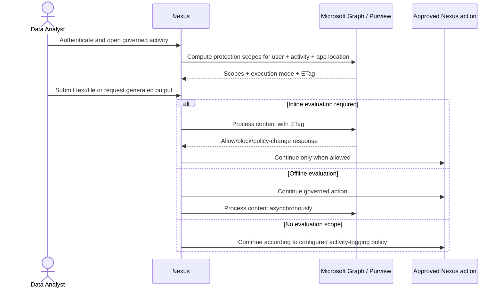

# Purview governance and agent architecture

> [FVSD Nexus](../../README.md) / [Documentation](../README.md) / [Architecture](README.md) / Purview governance

**Status:** Proposed reference architecture; documentation only

## Architectural intent

The Data Analyst workspace should compose existing governed FVSD capabilities without collapsing their boundaries. Fabric documentation explains technical truth, Dataverse records the data-product lifecycle, Purview provides enterprise governance and application policy, and the Data Product Agent coordinates bounded agent workflows.

The exact invocation path is open. Nexus might initially deep-link to the existing Copilot experience, later call a stable orchestration facade, or invoke approved agents through a supported agent-to-agent mechanism. Nexus must not depend directly on internal child-agent identifiers or free-form prompts as an integration contract.

## Authoritative ownership

| Concern | Proposed authority |
|---|---|
| Fabric object identity, expression, and surfaced lineage | Fabric Analytics Documentation Agent and its Catalog/Lineage tables |
| FVSD data-product registration and lifecycle | Dataverse `fvsd_dataproduct` and established agent contracts |
| Business ownership and stewardship assignments | Confirmed Dataverse governance bindings |
| Enterprise catalog domains, products, glossary, curation, and health | Microsoft Purview Data Map/Unified Catalog |
| Source-data access | Fabric, Azure, Dataverse, or other source permissions; never inferred from catalog access |
| Nexus experience visibility | Nexus role mapping, including Data Analyst |
| In-app text/file policy decision | Microsoft Purview policies evaluated through Microsoft Graph |
| Workflow trace | Shared correlation across Nexus plus the established agent audit contracts |

## Integration adapters

### Agent orchestration adapter

- Accept typed Nexus intents such as Explain Object, Find Data Product, Register/Update Product, Request Review, or Publish Catalog Entry.
- Translate only to a published contract supported by the Data Product Agent capability.
- Preserve the initiating user, role context, correlation identifier, and confirmation state.
- Return structured success, warning, review-required, denied, unsupported, or failure results.
- Never scrape conversational output as if it were a stable API contract.

### Purview catalog adapter

- Keep Data Map/Unified Catalog discovery and catalog writes separate from Microsoft Graph policy evaluation.
- Use least-privilege Purview roles and supported APIs/tools for the tenant's account type.
- Require explicit confirmation for metadata or publication changes.
- Treat catalog metadata as descriptive governance information, not source-data authorization.

### Purview policy adapter

- Use delegated Microsoft Graph permissions for the known signed-in user where the documented API requires user context.
- Compute protection scopes for the relevant Nexus application location and activity.
- Cache the returned ETag and supply it to content processing so policy changes can be detected.
- Apply inline versus offline execution correctly; the most restrictive applicable scope wins.
- Support text/file upload and download activities only when the Nexus feature actually performs them.
- Return a safe policy outcome without exposing sensitive information, policy internals, or submitted content in logs.

## Policy decision sequence

## Security and privacy boundaries

- Data Analyst is an experience role, not a Purview administrator role.
- Destination permissions are evaluated for every underlying operation.
- App-only access must not replace user-scoped evaluation where Microsoft documents delegated user permissions.
- Do not send entire student records, source datasets, semantic-model results, or unnecessary context for policy evaluation.
- Do not log submitted content, Purview tokens, Graph payloads, sensitivity details, or restricted policy internals.
- Apply data minimization and confirm Canadian/tenant processing expectations before enabling content submission.
- Agent-generated content receives the same policy treatment as user-created content when it crosses an applicable upload/download boundary.

## Reliability behaviour

- An inline policy-evaluation outage should fail closed for the protected action unless FVSD policy explicitly defines another compliant outcome.
- Offline evaluation failures require a durable retry and operational alert without retroactively claiming evaluation succeeded.
- A changed/invalid ETag requires protection scopes to be recomputed.
- Agent or catalog unavailability should degrade to a clear unavailable state; Nexus must not fabricate documentation or publication status.
- Duplicate commands must not create duplicate Dataverse or Purview catalog changes.

## Contract and test requirements

- Contract tests for every supported Data Product Agent intent and terminal result.
- Grounding tests showing documentation exactly matches the Fabric agent contract.
- Permission tests for Data Analyst, Data Steward, Technical Owner, and unauthorized roles.
- Purview catalog read/write tests using least-privilege identities.
- Protection-scope tests for no scope, offline, inline, multiple scopes, changed ETag, denial, timeout, and unavailable service.
- Audit tests proving one correlation chain across Nexus and agent events without sensitive payloads.
- Accessibility tests for policy-block messages, review actions, and unavailable states.

## Explicit exclusions at this stage

- No selection of an agent invocation technology.
- No Purview Graph permissions or tenant policy changes.
- No new governance tables or duplication of `fvsd_dataproduct`.
- No automatic catalog publication based solely on an AI recommendation.
- No extraction of Purview analytics through the policy APIs; Microsoft states that capability is not available through this API surface.

## Related documentation

- [Purview Data Analyst capability](../capabilities/purview-governance/README.md)
- [Purview and FVSD agent references](../reference/purview-resources.md)
- [Data and integrations](data-and-integrations.md)
- [Identity, licensing, and security](identity-licensing-security.md)
